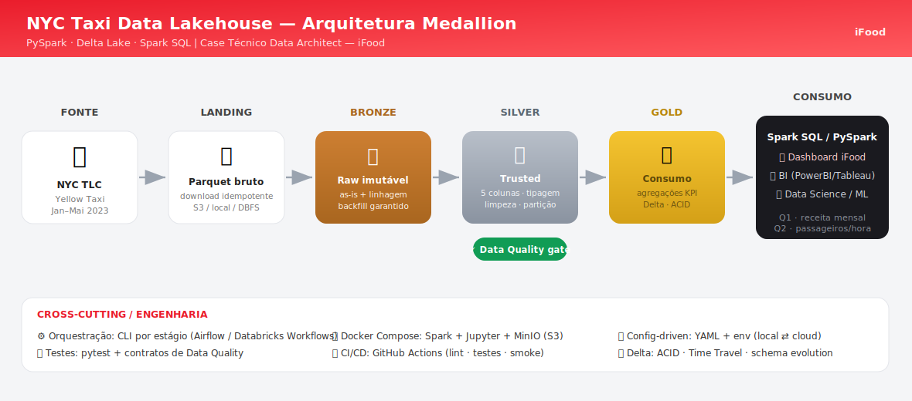

# Arquitetura — NYC Taxi Data Lakehouse

> Documento técnico que detalha as decisões de arquitetura da solução do case.
> Para a visão executiva e instruções de execução, veja o [README](../README.md).

## 1. Paradigma: Lakehouse + Medallion

A solução abandona a dicotomia Data Warehouse rígido × Data Lake caótico
("data swamp") em favor do modelo **Lakehouse**, organizando o fluxo na
topologia **Medallion** (Bronze → Silver → Gold). Cada camada tem um contrato
claro de responsabilidade, garantindo idempotência, rastreabilidade e
flexibilidade analítica.

| Camada | Papel | Processamento | Formato | Consumidor |
|--------|-------|---------------|---------|------------|
| **Bronze** | Landing/Raw | Nenhum (as-is) + metadados de linhagem | Parquet/Delta | Eng. de Dados, recovery, reprocessamento |
| **Silver** | Trusted | Seleção de colunas, tipagem, limpeza, partição | Delta (Snappy) | Data Science, EDA |
| **Gold** | Consumo | Agregações de negócio (KPIs), views | Delta | BI, analistas, dashboard |

### Bronze — imutabilidade
Ponto de entrada **imutável**. Lê os Parquet originais e persiste sem
transformação, adicionando apenas metadados de linhagem (`_source_file`,
`_ingested_at`, `_source_month`). Particionada por `_source_month` (derivado do
nome do arquivo): com *dynamic partition overwrite*, reprocessar um mês
reescreve só aquela partição. Se uma regra da Silver se provar errada no futuro,
o histórico intocado permite reprocessamento total (**backfilling**).

### Silver — domínio transacional confiável
É aqui que o **PySpark** faz o trabalho pesado (exigência do case). Aplica:
projeção das **5 colunas exigidas** (`VendorID`, `passenger_count`,
`total_amount`, `tpep_pickup_datetime`, `tpep_dropoff_datetime`) via `.select()`
— acionando *column pruning* do Catalyst; **tipagem estrita** (`cast`);
**limpeza** (dedup, drop de nulos, remoção de anomalias que violam regras de
negócio/física); e **particionamento** por `trip_month`. Um **gate de Data
Quality** bloqueia a promoção de dados que falhem os contratos.

### Gold — orientada ao consumidor
Materializa tabelas de negócio que respondem diretamente às perguntas do case
(`agg_receita_mensal`, `agg_passageiros_hora_maio`) e um fato granular `trips`
para consultas ad-hoc. Pré-agregar acelera o BI e desacopla o consumo do volume
da Silver. Em **Delta Lake**, ganha ACID e *Time Travel*.

## 2. Decisões-chave (resumo dos ADRs)

- **Delta Lake** como formato de tabela (ACID, *time travel*, *schema
  evolution*) — [ADR-001](adr/ADR-001-delta-lake.md).
- **Medallion** de 3 camadas como organização lógica/física —
  [ADR-002](adr/ADR-002-medallion.md).
- **Particionamento por `trip_month`** (baixa cardinalidade, alinhado às
  consultas), com nota sobre Z-Order/Liquid Clustering em escala —
  [ADR-003](adr/ADR-003-partitioning.md).

## 3. Portabilidade local ⇄ nuvem

Todo o código é *config-driven* (`conf/pipeline.yaml` + variáveis de ambiente).
O mesmo pipeline roda:

- **Local / Docker**: caminhos `data/...`, MinIO como S3 local (`--profile cloud`).
- **Databricks Community**: aponte os caminhos para `dbfs:/...` e importe o
  notebook em `analysis/notebooks/`.
- **AWS**: aponte para `s3a://...`; o Spark grava nativamente.

## 4. Qualidade, testes e operação

- **Data Quality** declarativo (`src/ifood_case/quality.py`) como gate entre
  camadas — estilo *Great Expectations*, sem dependência pesada.
- **Testes** unitários (`pytest`) das transformações puras, contratos e
  respostas, com SparkSession local.
- **CI/CD** (GitHub Actions): lint, type-check, testes e *smoke test* do
  pipeline ponta-a-ponta com dados sintéticos.
- **Orquestração**: a CLI por `--stage` mapeia 1:1 para tasks de um DAG
  (`bronze >> silver >> gold`) em Airflow ou Databricks Workflows.

## 5. Performance

Decisões de performance já embutidas no pipeline:

- **DQ em passada única**: todas as expectativas viram expressões de um único
  `df.agg(...)` — 1 job Spark, em vez de um `count()` por checagem (que
  recomputaria a linhagem, incluindo o shuffle do dedup, N vezes).
- **`persist()` entre gate e write** (Silver): o job de DQ materializa o
  resultado e a escrita o reutiliza — a linhagem completa roda 1 vez.
- **Filtros antes do `dropDuplicates`**: reduz o volume que entra no shuffle
  do dedup (~5–8% a menos no dataset real).
- **`repartition(trip_month)` antes do write**: 1 arquivo por partição, em vez
  de até `shuffle.partitions × meses` small files.
- **MERGE com coluna de partição na condição**: *partition pruning* no
  incremental — só os meses presentes no source são lidos/reescritos.
- **AQE explícito** + partição dinâmica: coalesce de shuffle em runtime e
  overwrite apenas das partições tocadas.

## 6. Escalabilidade

Para a volumetria real (~16M linhas/mês), as alavancas são: particionamento +
`OPTIMIZE`/Z-Order (ou **Liquid Clustering** em tabelas novas no Databricks),
`spark.sql.shuffle.partitions` ajustado ao cluster, *Change Data Feed* para
incrementais na Gold, e compactação de small files. O design já está pronto para
trocar leitura *full* por incremental por data de ingestão (watermark persistido
sobre `_ingested_at`).
