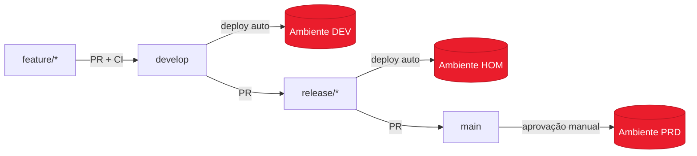

# CI/CD & Estratégia de Ambientes (Dev / Hom / Prd)

Este projeto adota **branches por ambiente** com **GitHub Environments**,
seguindo as práticas recomendadas: separação de segredos por ambiente,
homologação espelhando produção e **aprovação manual** antes do go-live.

## 1. Mapeamento branch → ambiente

| Branch | Ambiente | Deploy | Config (`IFOOD_ENV`) | Formato |
|--------|----------|--------|----------------------|---------|
| `develop` | **Dev** | automático no push | `conf/pipeline.dev.yaml` | Parquet (feedback rápido) |
| `release/*` | **Hom** | automático após CI | `conf/pipeline.hom.yaml` | Delta (espelha prd) |
| `main` | **Prd** | **aprovação manual** | `conf/pipeline.prd.yaml` | Delta |

> O pipeline escolhe a config automaticamente pela variável `IFOOD_ENV`
> injetada pelo workflow (ver `src/ifood_case/config.py::resolve_config_path`).

## 2. Fluxo de promoção

```
feature/minha-feature
        │  PR + CI (lint, testes, smoke)
        ▼
     develop ───────────────►  deploy automático em DEV
        │  PR
        ▼
   release/x.y  ─────────────►  deploy automático em HOM (validação/UAT)
        │  PR
        ▼
       main  ── aprovação ───►  deploy em PRD (required reviewers)
                manual
```

Hotfix: branch `hotfix/*` a partir de `main`, PR de volta para `main` e
*back-merge* em `develop`/`release`.

## 3. Diagrama



## 4. Configuração no GitHub (uma vez)

### 4.1 Environments — `Settings > Environments`
Crie **`dev`**, **`hom`** e **`prd`**. Para cada um:

- **Secrets** (não vão para o código): `AWS_ACCESS_KEY_ID`, `AWS_SECRET_ACCESS_KEY`,
  `DATABRICKS_TOKEN`, etc. — valores distintos por ambiente.
- **Variables**: `DATABRICKS_HOST`, nomes de bucket, etc.

No **`prd`**, habilite as *protection rules*:

- ✅ **Required reviewers** (1–2 aprovadores) → gate de aprovação manual.
- ✅ **Deployment branches**: apenas `main`.
- ⏱️ *Wait timer* opcional (ex.: 5 min) e *prevent self-review*.

No **`hom`**, opcionalmente *required reviewers* (QA) e branches `release/*`.

### 4.2 Branch protection — `Settings > Branches`
Para `main` e `develop` (e `release/*` via padrão):

- ✅ Require a pull request before merging (+ 1 aprovação).
- ✅ Require status checks to pass → selecione o job **CI / quality**.
- ✅ Require branches to be up to date / linear history.
- ✅ Require review from **Code Owners** (usa `.github/CODEOWNERS`).
- ✅ Do not allow bypass / include administrators.

## 5. Workflows

- **`.github/workflows/ci.yml`** — roda em PRs e pushes de `develop`, `release/*`
  e `main`: lint, type-check, testes e *smoke test* do pipeline.
- **`.github/workflows/cd.yml`** — resolve o ambiente pela branch, vincula o job
  ao **GitHub Environment** correspondente (aplicando as protection rules) e
  executa o deploy + *health check* pós-deploy.
- **`.github/workflows/auto-pr.yml`** — ao dar `git push` de uma branch
  `feature/**`, `fix/**`, `release/**` ou `hotfix/**`, **abre a Pull Request
  automaticamente** (base `develop`; `release/*` e `hotfix/*` vão para `main`).
  É idempotente (não duplica PR existente).

  > Habilite uma vez: **Settings > Actions > General > Workflow permissions** →
  > "Read and write" + marcar **"Allow GitHub Actions to create and approve pull
  > requests"**. Sem isso, o workflow registra um *warning* em vez de criar a PR.

> Segurança: nenhum segredo no repositório. Cada ambiente só enxerga os próprios
> secrets — a credencial de produção nunca é exposta em deploys de dev/hom.

## 6. Rodando localmente como cada ambiente

```bash
IFOOD_ENV=dev  python -m ifood_case.main --stage all   # usa pipeline.dev.yaml
IFOOD_ENV=hom  python -m ifood_case.main --stage all   # usa pipeline.hom.yaml
IFOOD_ENV=prd  python -m ifood_case.main --stage all   # usa pipeline.prd.yaml
```

## 7. Primeira configuração das branches

```bash
git checkout -b develop && git push -u origin develop
git checkout -b release/1.0 && git push -u origin release/1.0
# main já é a default; configure as protections conforme a seção 4.
```
